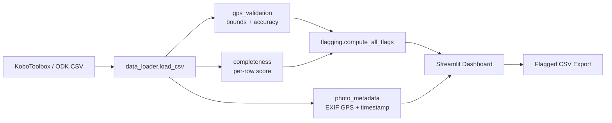

# Field Data QA Dashboard

[](https://streamlit.io)
[](https://python.org)
[](LICENSE)
[](tests/)
[](https://github.com/achmadnaufal/field-data-qa-dashboard/commits)

Streamlit web app for validating field data submissions from **KoboToolbox/ODK**. Built for NbS/carbon field teams collecting baseline and monitoring data in Indonesia.

## Architecture



## Quick Start

```bash
# 1. Install dependencies
pip install -r requirements.txt

# 2. Run the app
streamlit run app.py

# 3. Open in browser
# http://localhost:8501
```

## Features

- **GPS Plausibility Checks** — Validates coordinates against Indonesia's bounding box and checks GPS accuracy thresholds
- **Completeness Scoring** — Scores each submission across required fields with per-field and per-row breakdowns
- **Photo Metadata Viewer** — Extracts EXIF GPS coordinates, timestamps, and camera info from uploaded photos
- **Submission Timeline** — Interactive Plotly chart showing submissions over time
- **Flag & Review UI** — Flags suspicious records (out-of-bounds GPS, low completeness, duplicates) with a review workflow
- **Export to CSV** — Download flagged records for offline review or reporting

## Usage

Run the QA pipeline against the bundled sample of 25 Indonesian field submissions:

```bash
python -c "from src.data_loader import load_csv, get_summary_stats; \
from src.gps_validation import add_gps_flags; \
from src.completeness import add_completeness_score; \
from src.flagging import compute_all_flags, get_flag_summary; \
df = compute_all_flags(add_completeness_score(add_gps_flags(load_csv('demo/sample_data.csv')))); \
print(get_summary_stats(df)); print(get_flag_summary(df))"
```

Real captured output:

```
Summary stats:
  total_rows: 25
  total_columns: 14
  date_range: 2026-03-01 — 2026-03-13
  unique_submitters: 5
  unique_plots: 23

Flag summary:
  gps_poor_accuracy: 3
  gps_missing: 1
  gps_out_of_bounds: 1

Flagged records: 5/25
Avg completeness score: 97.7%

Per-field completeness:
  submission_id: 100%   plot_id: 100%        canopy_cover_pct: 100%
  submitter:    100%    species: 96%         soil_type: 96%
  submission_date:100%  tree_count: 100%     land_use: 96%
  latitude:     96%     dbh_cm: 96%          photo_id: 96%
  longitude:    96%
  gps_accuracy: 96%
```

## Sample Output

Load the included demo data (25 realistic Indonesian field records) to see:

| View | Description |
|------|-------------|
| Overview | Record count, submitter count, date range metrics |
| GPS Validation | Interactive map with in-bounds/out-of-bounds markers |
| Completeness | Per-field bar chart and score distribution histogram |
| Timeline | Daily submission count bar chart |
| Flag & Review | Expandable cards with review status and CSV export |

## Tech Stack

| Component | Library |
|-----------|---------|
| Web framework | Streamlit |
| Data processing | Pandas |
| Charts | Plotly |
| Image processing | Pillow |
| HTTP client | Requests |
| Testing | pytest |

## Project Structure

```
field-data-qa-dashboard/
├── app.py                       # Main Streamlit application
├── src/
│   ├── gps_validation.py        # GPS plausibility checks
│   ├── completeness.py          # Completeness scoring
│   ├── photo_metadata.py        # EXIF metadata extraction
│   ├── flagging.py              # Flag/review logic
│   ├── charts.py                # Interactive Plotly charts
│   └── data_loader.py           # CSV loading and validation
├── demo/
│   └── sample_data.csv          # 25 realistic Indonesian records
├── tests/
│   ├── test_gps_validation.py   # GPS check tests
│   ├── test_completeness.py     # Completeness scoring tests
│   ├── test_photo_metadata.py   # EXIF extraction tests
│   ├── test_flagging.py         # Flagging logic tests
│   ├── test_data_loader.py      # Data loader tests
│   └── test_charts.py           # Chart generation tests
├── docs/
│   └── SCREENSHOTS.md           # App screenshots documentation
├── requirements.txt
├── LICENSE
└── README.md
```

## Running Tests

```bash
pytest tests/ -v
```

## License

[MIT](LICENSE)

---

> Built by [Achmad Naufal](https://github.com/achmadnaufal) | Lead Data Analyst | Power BI · SQL · Python · GIS
